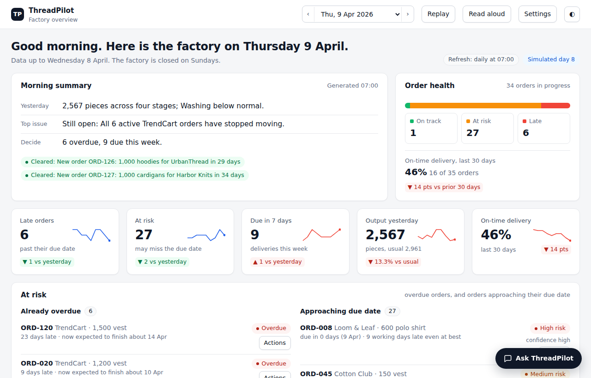
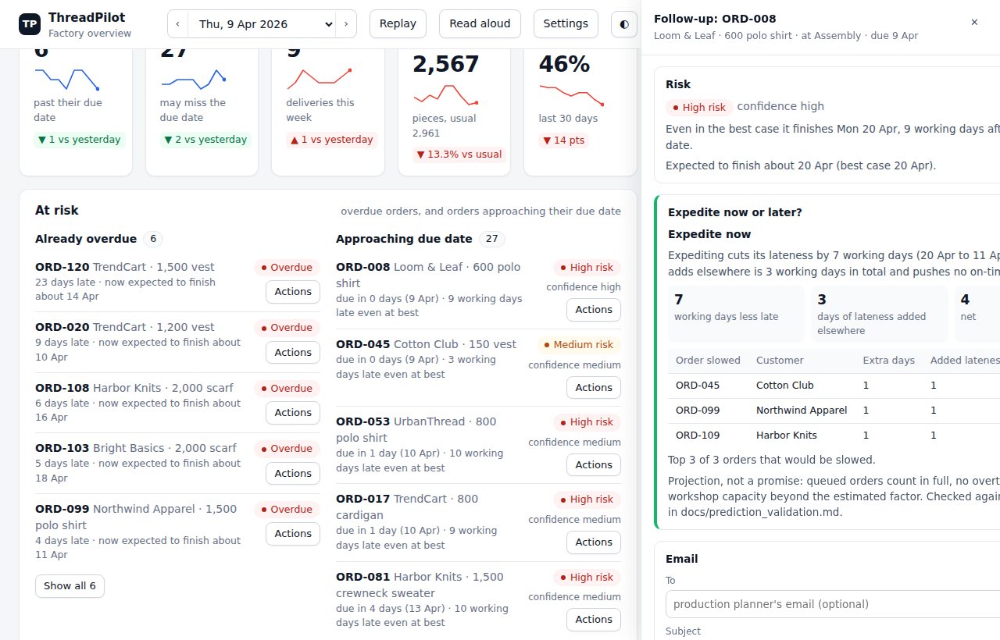
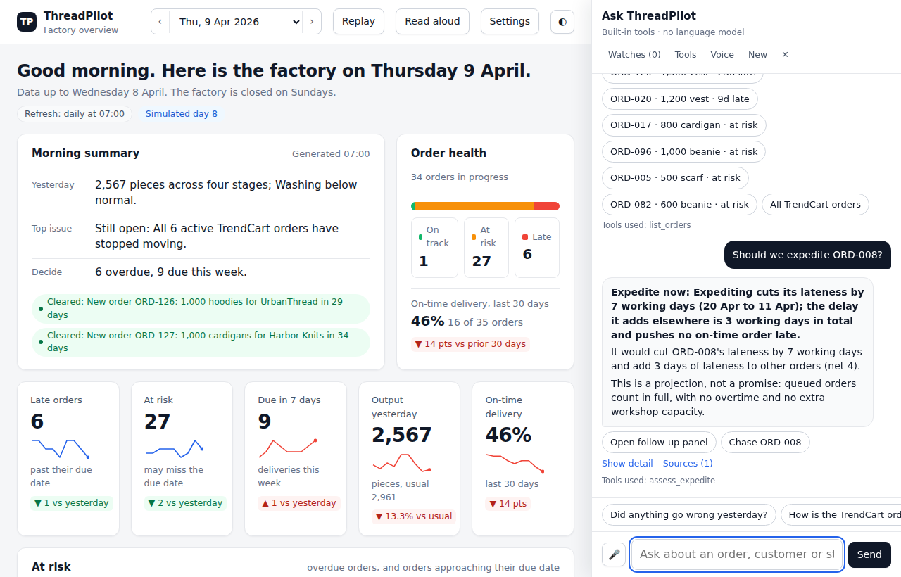
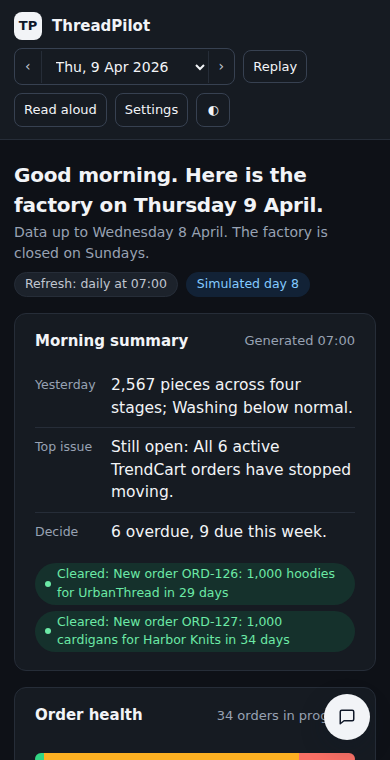
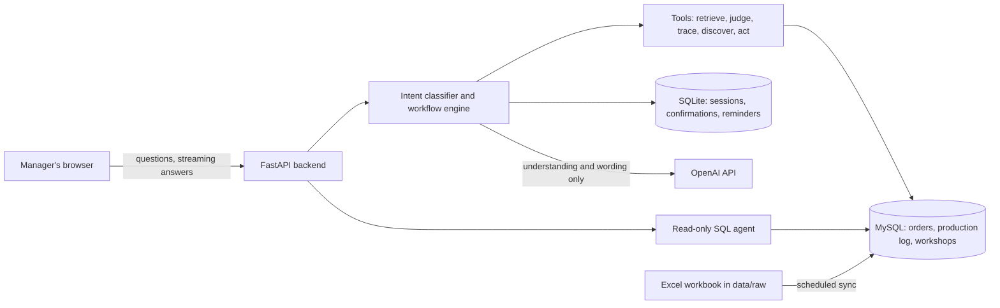

# ThreadPilot: the General Manager's AI Co-Pilot

An AI co-pilot for the general manager of a quick-response knitwear factory. It writes the morning briefing, answers
questions from live data all day, keeps standing watches, estimates whether a new order is feasible, and drafts
chase-ups and reminders that are confirmed before they happen and logged after.

DSS5105 capstone, Track 1 · NUS MSc · [中文说明](threadpilot/README.zh.md)



## Contents

- [What it does](#what-it-does)
- [Screenshots](#screenshots)
- [How it works](#how-it-works)
- [Quick start](#quick-start)
- [Configuration](#configuration)
- [Data, and keeping it up to date](#data-and-keeping-it-up-to-date)
- [Briefing, simulator and predictions](#briefing-simulator-and-predictions)
- [The dashboard](#the-dashboard)
- [API](#api)
- [Testing and CI](#testing-and-ci)
- [Sharing it with other people](#sharing-it-with-other-people)
- [Repository layout](#repository-layout)
- [Documentation](#documentation)
- [Limitations](#limitations)
- [Troubleshooting](#troubleshooting)
- [Contributing and security](#contributing-and-security)
- [Team, credits and licence](#team-credits-and-licence)

---

## What it does

The general manager runs the factory on the move and does not write SQL. Their questions arrive all day:

| When | The manager asks | ThreadPilot |
|---|---|---|
| 07:00 | "Did anything go wrong yesterday?" | A **morning briefing** in three lines (what happened, what is at risk, what needs a decision), with the detail one click away |
| 09:40 | "How is the TrendCart order doing?" | **Multi-turn answers** from fresh data. TrendCart has several orders, so it asks which one instead of guessing |
| 11:15 | "Can we take 800 hoodies by the 25th?" | A **feasibility estimate**: a date range and the assumptions behind it, never a plain yes |
| 14:30 | "That order hasn't moved in a week. Chase it up." | A **drafted chase-up**, sent only after confirmation, and logged |
| 17:00 | "Remind me tomorrow if packing is still behind." | A **standing watch** that checks the data itself and raises an alert |

Five rules run through the whole system:

1. **The language model never does the arithmetic.** Tools compute totals, baselines and comparisons; the model only
   understands the question and narrates the tool results.
2. **Every number traces back to its rows.** Answers and findings carry the source file and line, or the database
   record, they came from.
3. **Ask, don't guess, and say what cannot be answered.** The data holds no prices, revenue or worker names, so
   ThreadPilot says so instead of inventing a figure.
4. **Confirm first, log after.** Anything with a side effect (a chase-up, a note, a reminder) shows what it will do
   and its worst case, waits for confirmation, and is written to an audit log.
5. **Proactive is a dial.** Findings are ranked, only the top five make the page, and items already reported fade
   unless they get worse.

There are two ways to see it:

* **The full system**: a FastAPI backend with MySQL and the OpenAI API, run with Docker or locally.
* **The briefing demo**: one HTML file that opens in any browser with no installation and no API key. It replays two
  simulated weeks of mornings with the dashboard, predictions and a built-in chat assistant.

---

## Screenshots

| At-risk orders and the follow-up panel | The chat assistant |
|---|---|
|  |  |



---

## How it works



| Part | What it is | Where |
|---|---|---|
| Backend | FastAPI service: intent classification, workflow engine, tools, data API, read-only SQL agent (LangChain), reminder monitor | [`threadpilot/backend/`](threadpilot/backend) |
| Front end | Browser interface, served by the backend at `/` | [`threadpilot/frontend/`](threadpilot/frontend) |
| Database | MySQL 8, schema managed with Alembic; a small SQLite file for chat sessions and reminders | [`threadpilot/data/migrations/`](threadpilot/data/migrations) |
| Seed data | 120 orders, 90 days of production at four stages, 8 workshops | [`threadpilot/data/`](threadpilot/data) |
| Briefing demo | Simulator, briefing builder, risk/expedite/forecast models, dashboard and chat; runs offline | [`threadpilot/simulation/`](threadpilot/simulation), [`threadpilot/demo/`](threadpilot/demo) |
| ML | Order-delay probability model and feasibility tools (prototype, not yet connected) | [`threadpilot/ml/`](threadpilot/ml) |

MySQL uses three separate accounts: **root** only to create the database, an **application** account that reads and
writes, and a **read-only AI** account for the SQL agent, so the model can never change data.

---

## Quick start

All commands run inside the `threadpilot/` folder unless a step says otherwise.

### A. Look at the demo (nothing to install)

Open [`threadpilot/demo/briefing_demo.html`](threadpilot/demo/briefing_demo.html) in a browser (download it, or clone
the repository). Use the date picker or the arrow keys to move between mornings, **Replay** to step through the
fortnight, and **Ask ThreadPilot** to open the chat. To rebuild it after changing the simulator:

```bash
python -m simulation.render_demo --days 14
```

### B. Run the full system with Docker (recommended)

You need [Docker Desktop](https://www.docker.com/products/docker-desktop/) and an
[OpenAI API key](https://platform.openai.com/api-keys) with a monthly spending limit set.

1. **Create your private settings file** and fill in fresh random passwords (they are written to `.env`, not shown):

   ```bash
   cp .env.example .env
   python3 - <<'EOF'
   import re, secrets, pathlib
   p = pathlib.Path(".env"); t = p.read_text()
   for k in ("MYSQL_ROOT_PASSWORD", "MYSQL_APP_PASSWORD", "MYSQL_AI_PASSWORD", "DATA_API_TOKEN"):
       t = re.sub(rf"(?m)^{k}=.*$", f"{k}={secrets.token_hex(24)}", t)
   p.write_text(t)
   EOF
   ```

2. **Add your OpenAI key**: open `.env` (`open -e .env` on a Mac, `notepad .env` on Windows) and paste the key straight
   after `OPENAI_API_KEY=`, with no spaces or quotes.

3. **Start everything.** The first run downloads MySQL and builds the app, which takes a few minutes:

   ```bash
   docker compose up --build -d
   docker compose ps -a        # mysql: healthy, backend: running, provision: Exited (0)
   ```

4. **Load the seed data** (expect three success lines: 120, 360 and 8 rows):

   ```bash
   docker compose run --rm backend python -m scripts.init_db --skip-migrate --seed-existing
   ```

5. **Open <http://127.0.0.1:8000>** and type `Open ORD-005`. Health check: <http://127.0.0.1:8000/api/v1/health>.
   Interactive API documentation: <http://127.0.0.1:8000/docs>.

Stop with `docker compose down` (data is kept). Start again later with `docker compose up -d`. Wipe the database with
`docker compose down -v`, then repeat steps 3 and 4.

### C. Run locally without Docker (for development)

You need Python 3.12 or 3.13, [uv](https://docs.astral.sh/uv/) and MySQL 8 running locally. All commands run in
`threadpilot/backend/`.

```bash
cd backend
uv sync --locked --group dev
cp .env.example .env     # put DATA_API_TOKEN, OPENAI_API_KEY and the two passwords into DATABASE_URL / AI_DATABASE_URL
```

Create the database, accounts and tables, then load the seed data. The passwords are typed, never stored:

```bash
export MYSQL_HOST=127.0.0.1 MYSQL_PORT=3306 MYSQL_DATABASE=threadpilot
read -r -s -p 'MySQL root password: ' MYSQL_ROOT_PASSWORD; echo
read -r -s -p 'Application password: ' MYSQL_APP_PASSWORD; echo
read -r -s -p 'AI read-only password: ' MYSQL_AI_PASSWORD; echo
export MYSQL_ROOT_PASSWORD MYSQL_APP_PASSWORD MYSQL_AI_PASSWORD
uv run python -m scripts.provision_mysql
unset MYSQL_ROOT_PASSWORD MYSQL_APP_PASSWORD MYSQL_AI_PASSWORD
uv run python -m scripts.init_db --skip-migrate --seed-existing
uv run uvicorn app.main:app --host 127.0.0.1 --port 8000 --reload
```

On Windows PowerShell, set the same variables with `$env:NAME = '<value>'` and remove them afterwards with
`Remove-Item Env:NAME`. The Chinese guide, [`README.zh.md`](threadpilot/README.zh.md) section 7, walks through every
step for both systems.

---

## Configuration

Settings live in `threadpilot/.env` for Docker and `threadpilot/backend/.env` for local runs. Both are ignored by git;
the `.env.example` files are the templates.

| Setting | Default | Purpose |
|---|---|---|
| `MYSQL_ROOT_PASSWORD`, `MYSQL_APP_PASSWORD`, `MYSQL_AI_PASSWORD` | none | Three **different** random passwords: root (used only to provision), application (read and write), AI (read-only) |
| `MYSQL_DATABASE`, `MYSQL_APP_USER`, `MYSQL_AI_USER` | `threadpilot`, `threadpilot_app`, `threadpilot_ai` | Database and account names |
| `MYSQL_PORT`, `API_PORT` | `3306`, `8000` | Ports, bound to `127.0.0.1` only so nothing is reachable from outside the machine |
| `OPENAI_API_KEY` | empty | Your key. Without it the AI features do not answer |
| `OPENAI_BASE_URL`, `OPENAI_MODEL`, `OPENAI_TIMEOUT_SECONDS` | `https://api.openai.com/v1`, `gpt-4.1`, `60` | Model provider settings |
| `INTENT_API_STYLE` | `responses` | `chat_completions` for providers that only offer Chat Completions with JSON mode |
| `DATA_API_TOKEN` | none | Admin token for data changes and uploads (`Authorization: Bearer ...`) |
| `BUSINESS_NOW` | `2026-04-01T08:00:00+08:00` | What "today" is. The seed data ends on 31 March 2026; use `live` only once the database receives current data |
| `SYNC_ENABLED`, `SYNC_INTERVAL_MINUTES`, `SYNC_FILES` | `false`, `5`, `["source.xlsx"]` | Scheduled import of Excel or CSV files from `data/raw/` (see below) |
| `SQL_MAX_ROWS`, `SQL_TIMEOUT_MS`, `SQL_AGENT_STEPS` | `100`, `5000`, `16` | Limits for the read-only SQL agent |
| `CHASE_WEBHOOK_URL`, `CHASE_WEBHOOK_TOKEN` | empty | If set, confirmed chase-ups are posted to this webhook; if empty they are only logged |
| `REPLY_INGEST_TOKEN` | empty | Protects the endpoint that receives replies to chase-ups |

---

## Data, and keeping it up to date

**Seed dataset** ([data dictionary](threadpilot/data/data_dictionary.md)): 120 orders, 360 production rows (90 days
at four stages: knitting, assembly, washing, packing) and 8 workshops. The business date is 1 April 2026 and the
factory is closed on Sundays. The data holds no prices, revenue or worker names.

**Keep the data current from Excel.** The backend can watch a workbook and import changes on a schedule:

1. Copy the template into the watched folder: `cp data/source.xlsx data/raw/source.xlsx`.
2. In `.env` set `SYNC_ENABLED=true`, `SYNC_INTERVAL_MINUTES=1` and `SYNC_FILES=["source.xlsx"]`, then run
   `docker compose up -d`.
3. Edit `data/raw/source.xlsx`, save and close it. The database updates within the interval.

Import rules ([full detail](threadpilot/docs/data_pipeline.md)):

* Sheets must be named exactly `orders`, `production_log` and `workshops`. Unknown columns, unknown sheets and invalid
  dates are rejected; the whole file is imported in one transaction.
* Changed rows are updated and new rows are added. **Deleting a row in Excel does not delete it from the database**;
  deletions go through the data API.
* A file is skipped while it is still being written. If the file and the API changed the same row, the import is
  rejected (HTTP 409) and logged; see `GET /api/sync/logs`.

**Upload a file instead** (anyone with the admin token can do this, so share it only within the team):

```bash
curl -X POST http://127.0.0.1:8000/api/sync/import \
  -H "Authorization: Bearer YOUR_DATA_API_TOKEN" -H "X-Confirm-Write: true" -F "file=@source.xlsx"
```

**A note on the data.** The production log does not reconcile with the order sizes: in the 60 days before 1 April,
orders totalling 56,950 pieces finished, while the log shows packing handled 33,634. The prediction models calibrate
capacity from completions and record the factor in every briefing; see
[prediction_validation.md](threadpilot/docs/prediction_validation.md), section 1.

---

## Briefing, simulator and predictions

The provided data is a single snapshot, and a briefing built on a snapshot says the same thing every morning.
[`simulation/`](threadpilot/simulation) rolls the factory forward one working day at a time and builds a briefing
for each morning:

* **Simulator** (`simulate.py`): deterministic and seeded (same input, byte-identical files on any machine), keeps
  the original CSV columns, and injects **planted events** from
  [`scenarios/default.json`](threadpilot/simulation/scenarios/default.json): a slowdown, a machine breakdown, a
  customer hold, a quiet order and a rush order. The briefing never reads that file, so the events are ground truth
  for testing discovery.
* **Briefing** (`briefing.py`): "normal" output is the average of the previous 8 same weekdays with a band;
  discovery looks for stages below normal, customers whose orders all stopped, orders that went quiet while later-due
  orders moved, overdue orders and work piling up; findings are scored, ranked and traced to CSV lines.
* **Predictions** (`prediction.py`): a day-by-day projection of the queue gives each order a **risk level and
  confidence**, an **expedite now or later** assessment (how much less late it becomes against the delay pushed onto
  other orders), and a **two-week order forecast**.

```bash
python -m simulation.simulate --days 5            # data as of 6 April, in data/live/
python -m simulation.briefing --data data/live    # print that morning's three-line briefing
python -m simulation.render_demo --days 14        # all mornings, archived to briefings/, plus the demo page
python -m simulation.evaluate_discovery           # did discovery find the planted events?
python -m simulation.backtest                     # check risk, expedite and forecast (about a minute)
```

How well it holds up, briefly ([full results](threadpilot/docs/prediction_validation.md)):

| Check | Result |
|---|---|
| Discovery of planted events | 5 of 5 found, 1 to 5 days after each started |
| Predicted finish dates against the simulation | average error 2.2 working days |
| Expedite gain predicted against simulated | average error 2.8 working days (one large miss) |
| Feasibility ranges against injected test orders | real finish inside the range in 14 of 14 cases |
| Two-week order forecast | **no better** than repeating the last period on the provided data |

The simulator follows the same scheduling rule as the models, so these checks show internal consistency, not
real-world accuracy.

---

## The dashboard

The demo page ([`demo/briefing_demo.html`](threadpilot/demo/briefing_demo.html)) is designed for a manager reading on a
phone between meetings:

* **Morning summary** in three lines, with what is new or cleared since yesterday.
* **Order health**, **KPI tiles** with two-week trend lines, and **Needs your attention** (top five findings, each
  with its next step and the rows behind it).
* **At risk**, split into *already overdue* and *approaching due date*, with a risk level and confidence for each order.
* A right-hand **follow-up panel** for any order: the expedite recommendation, an email draft that opens in your mail
  app, and a Teams message to copy.
* **Daily output** with the usual range and the next six days, **work in progress** with the bottleneck named, and the
  **orders** table with search and filters.
* **Expected orders** for the next two weeks, shown with how the forecast did on past data.
* **Memos** for amended delivery dates and specifications, and an **activity log** of confirmed actions.
* **Settings** for text size, typeface, per-stage targets (flagged after three missed days) and refresh.
* **Ask ThreadPilot**: a chat that answers from the same data with named tools, shows the rows behind each number,
  confirms before acting, and refuses questions the data cannot answer. Voice input and read-aloud where the browser
  supports them. Its tools and limits: [chat_tools.md](threadpilot/docs/chat_tools.md).

Light and dark themes follow the device. Settings and memos are kept in the browser. The demo chat uses built-in tools,
not a language model; open the page with `?api=<backend chat URL>` to send questions to a backend instead.

---

## API

The backend serves interactive documentation at `/docs`; the schema is in
[`docs/openapi.json`](threadpilot/docs/openapi.json), with details in
[`API_DOCUMENTATION.md`](threadpilot/backend/API_DOCUMENTATION.md) and [`STREAMING_API.md`](threadpilot/backend/STREAMING_API.md).

| Method | Path | Purpose | Access |
|---|---|---|---|
| GET | `/api/v1/health` | Health and configuration check | open |
| POST | `/api/v1/workflow/chat`, `/chat` | Ask the co-pilot (JSON answer) | open |
| POST | `/api/v1/workflow/chat/stream` | Ask the co-pilot (streamed answer) | open |
| GET | `/api/v1/evidence/{source}/{row}` | The source row behind a number | open |
| GET | `/api/v1/workflow/notifications/{session_id}` | Alerts from standing watches and reminders | open |
| POST | `/api/v1/workflow/replies` | Receive replies to chase-ups | `REPLY_INGEST_TOKEN` |
| GET | `/api/data`, `/api/data/{record_id}` | Read business records | open |
| POST, PUT, DELETE | `/api/data`, `/api/data/{record_id}` | Change business records | admin token + `X-Confirm-Write: true` |
| GET | `/api/evidence/{dataset}/{record_id}` | A record and where it came from | open |
| POST | `/api/sync/import` | Upload an Excel or CSV file | admin token + `X-Confirm-Write: true` |
| GET | `/api/sync/logs` | Recent imports | admin token |
| GET | `/api/snapshot` | Data snapshot for the front end | open |
| POST | `/api/ai/ask` | Read-only SQL agent | open |

"Open" means no token is needed, which is fine on `127.0.0.1`. **If you make the app reachable from the internet, put
it behind a password** (see the next section), because every question uses OpenAI credit.

---

## Testing and CI

```bash
# backend: temporary SQLite and mocked model calls, so no MySQL and no API key
cd backend && uv run --locked pytest -q              # 70 passed, 1 skipped (MySQL test needs TEST_MYSQL_URL)

# simulator, briefing, predictions, dashboard and chat (headless browser)
python -m pip install -r requirements-dev.txt && python -m playwright install chromium
python -m pytest -q tests/                           # 94 tests

# before every push: secrets, .env files, runtime data, oversized files, line endings
python scripts/check_repo.py
```

**Real-model checks** use the OpenAI API and cost credit: `uv run python -m scripts.smoke_live` asks one question,
and `uv run python -m scripts.evaluate_workflow` runs 45 dialogue turns and writes `runtime/live-evaluation.json`.
Report the first-run pass rate; see [live_model_verification.md](threadpilot/docs/live_model_verification.md).

**GitHub Actions** ([workflow](.github/workflows/threadpilot-tests.yml)) runs on every push and pull request that
touches `threadpilot/`: the safety check, the backend tests, the simulator/dashboard/chat tests, and a check that the
committed demo matches a fresh rebuild byte for byte. MySQL provisioning and Docker are not exercised by CI.

---

## Sharing it with other people

Docker runs the app on one machine; it does not create a link others can open. Choose by audience:

| Situation | Option | Notes |
|---|---|---|
| Presenting from your own laptop | Nothing extra | Run it locally and share your screen |
| Teammates testing during development | [Tailscale](https://tailscale.com/) with Tailscale Serve | Private network for invited people only; streaming answers work |
| A quick look by someone outside | Cloudflare quick tunnel: `cloudflared tunnel --url http://localhost:8000` | No account needed, but **no streaming**, a new link on every restart and no password |
| Lecturers at any time | A small cloud server (e.g. a DigitalOcean Droplet, 2 GB, Singapore) running the same `docker compose`, behind Caddy for HTTPS and a password | Always on; the GitHub Student Developer Pack includes DigitalOcean credit |

Whichever you choose: keep the `127.0.0.1` port bindings in `docker-compose.yml`, put a password in front of anything
public, set a monthly OpenAI spending limit, keep secrets only in the server's `.env`, and back up the database
(`mysqldump`) somewhere private, never in git. Hosting on a laptop means it must stay on and awake
(`caffeinate -dims` on a Mac).

---

## Repository layout

```
.
├── README.md                       this file
├── .github/workflows/              CI: safety check and tests
└── threadpilot/
    ├── backend/                    FastAPI app (app/), scripts (scripts/), tests (tests/), uv.lock
    ├── frontend/                   browser interface served by the backend
    ├── data/                       seed CSVs and workbook, data dictionary, Alembic migrations
    │   └── raw/                    watched folder for Excel sync (git-ignored)
    ├── simulation/                 simulator, briefing builder, predictions, demo page and chat
    ├── demo/                       generated demo page: open it directly
    ├── briefings/                  generated morning briefings, one JSON per simulated day
    ├── ml/                         delay-probability model prototype
    ├── prototypes/                 early single-file prototype, kept for reference
    ├── tests/                      simulator, prediction, chat and panel tests; browser end-to-end tests (e2e/)
    ├── scripts/check_repo.py       pre-push safety check
    ├── docs/                       documentation and screenshots
    ├── Dockerfile, docker-compose.yml
    └── requirements.txt            exported from backend/uv.lock for the Docker image
```

---

## Documentation

| Topic | Document |
|---|---|
| Team workflow, branches, pull requests | [CONTRIBUTING.md](threadpilot/CONTRIBUTING.md) |
| Status of every sprint item | [FEATURE_STATUS.md](threadpilot/docs/FEATURE_STATUS.md) |
| Risk, expedite, forecast: method, validation, limits | [prediction_validation.md](threadpilot/docs/prediction_validation.md) |
| Dashboard chat: tools, limits, validation | [chat_tools.md](threadpilot/docs/chat_tools.md) |
| Data pipeline and import rules | [data_pipeline.md](threadpilot/docs/data_pipeline.md) |
| Intent workflow and architecture (Chinese) | [workflow_design.md](threadpilot/docs/workflow_design.md), [INTENT_WORKFLOW.md](threadpilot/docs/INTENT_WORKFLOW.md) |
| User manual (Chinese) | [USER_MANUAL.md](threadpilot/docs/USER_MANUAL.md) |
| Live model verification | [live_model_verification.md](threadpilot/docs/live_model_verification.md) |
| Code review and known issues | [CODE_REVIEW.md](threadpilot/docs/CODE_REVIEW.md) |
| Dashboard design review | [DASHBOARD_REVIEW.md](threadpilot/docs/DASHBOARD_REVIEW.md) |
| Publishing to GitHub step by step | [GITHUB_GUIDE.md](threadpilot/docs/GITHUB_GUIDE.md) |
| ML delay model | [ml/README.md](threadpilot/ml/README.md) |

---

## Limitations

* **The data describes a factory that is badly behind**: about 29 working days of work in progress against 12 to 30
  days allowed, so nearly every order is late or at risk and risk levels spread out little.
* **The order forecast is no better than repeating the last period**, and its customer ranking is no better than chance
  on the provided data. It is shown as a rough range.
* **The predictions were checked only against the simulator**, which follows the same scheduling rule.
* **The demo chat recognises phrasings, not meaning**; unusual wording falls back to a help message. The backend's
  intent classifier handles free-form questions.
* **Settings and memos live in the browser**; memos do not yet change the risk model. Production needs a database
  table ([SQL sketch](threadpilot/docs/prediction_validation.md)).
* **Hourly refresh** is a saved setting only: the production log is daily and the demo builds one briefing per morning.
* **The ML delay model is a prototype** and is not connected to the backend.

---

## Troubleshooting

| Symptom | Fix |
|---|---|
| `The "MYSQL_APP_PASSWORD" variable is not set` or `required variable ... is missing a value` | `.env` is missing, in the wrong folder, or still has placeholders. It must sit next to `docker-compose.yml`; redo Quick start B, step 1 |
| `Cannot connect to the Docker daemon` / `docker: command not found` | Open Docker Desktop and wait until it says *Engine running* |
| `port is already allocated` | Another program uses the port: change `API_PORT` or `MYSQL_PORT` in `.env`, then `docker compose up -d` |
| `Access denied` after editing `.env` | The database keeps the passwords from its first start: `docker compose down -v`, then steps 3 and 4 again |
| Every order looks months late | `BUSINESS_NOW` is `live` while the data ends in March 2026: set `BUSINESS_NOW=2026-04-01T08:00:00+08:00` |
| Chat errors 401 or 429 | 401: wrong OpenAI key. 429: rate limit or no credit; wait and retry |
| A Mac shell script fails with `$'\r'` | Windows line endings: the repository keeps `.sh` files as LF; re-clone or run `python scripts/check_repo.py` |
| Excel changes do not appear | Check `SYNC_ENABLED=true`, the file is in `data/raw/`, the sheet names are exact, and `GET /api/sync/logs` |

---

## Contributing and security

Work on a branch and open a pull request; see [CONTRIBUTING.md](threadpilot/CONTRIBUTING.md). Before every push run
`python scripts/check_repo.py`: it fails on API keys, passwords written as literals, `.env` files, runtime databases
and keys, files over 50 MB, and shell scripts with Windows line endings. Never commit `.env`, never send it in chat
or email, and share `.env.example` instead. **If a secret is ever pushed, change it**: deleting it from the latest
version does not remove it from git history.

---

## Team, credits and licence

**Team:** Matthew, LIU JING, Kevin Royce Thomson, Anqi Lin, Wendy, and one more teammate (add your name here).
DSS5105 capstone, Track 1: the General Manager's Co-Pilot. National University of Singapore.

**Built with** FastAPI, SQLAlchemy and Alembic, MySQL, LangChain, the OpenAI API, uv, Docker, pytest and Playwright.
The SweaterCo dataset was provided by the course.

**Licence:** none yet, so all rights are reserved by the authors. The course dataset belongs to the course; ask before
reusing it. If the team agrees to open the code, add a licence file (MIT is the simplest).
